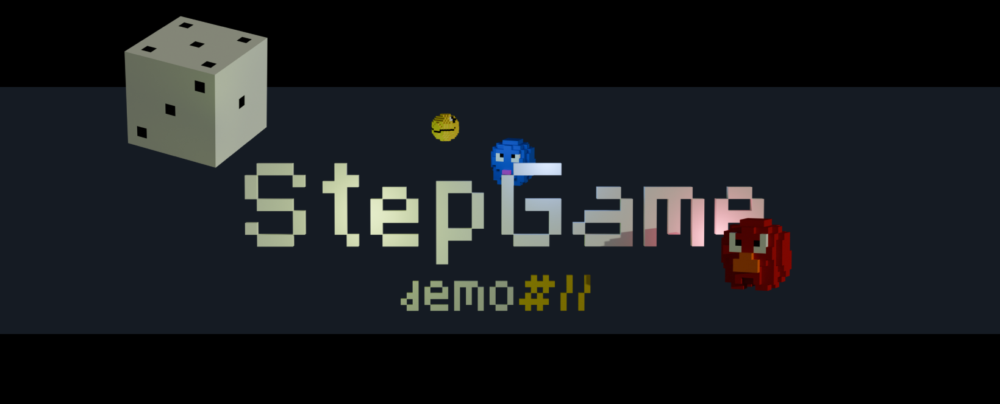

<p >
  
</p>

#  StepGame [demo]

Демо-проект для знакомства с Three.js. Загрузка моделей и взаимодействие с ними. Простая логика перемещений и набора очков. Это не игра, а демо [прототип] - геймдизайн отсутствует, просто тестирование. 

> Сделано с использованием **Three.js**, **React**, **TypeScript** 

### 🚀 Запуск

```bash
npm install
npm run start

```

#11